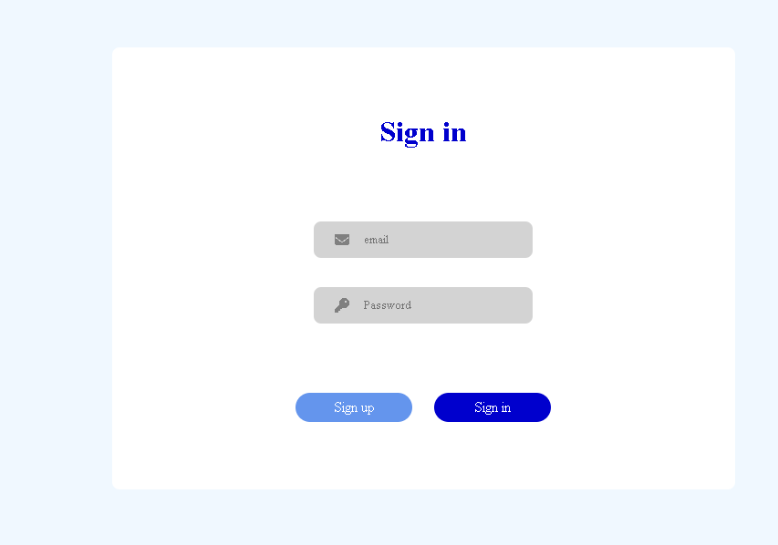
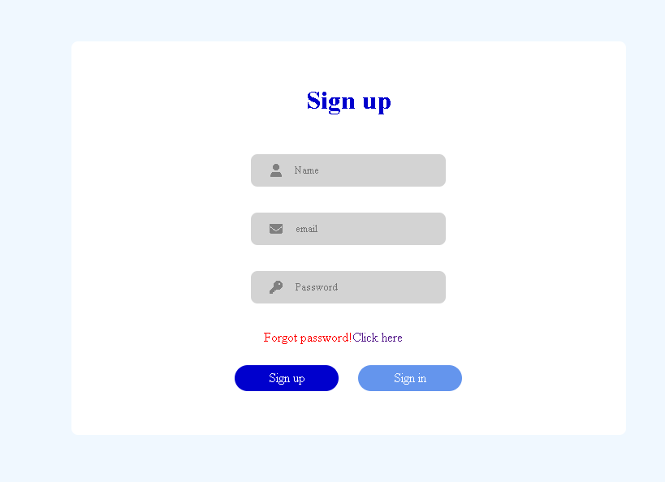

# login-form 
A lightweight authentication interface built with HTML, CSS, and Vanilla JavaScript.  
The project demonstrates dynamic UI state management and DOM manipulation without external frameworks.

---

## Overview

This project implements a single authentication component that toggles between **Sign In** and **Sign Up** modes without page reload.

The interface dynamically updates:

- Form heading
- Visibility of the name input field
- Button active states
- Forgot password section

All interactions are handled client-side using JavaScript.

---

## Features

- Toggle between Sign In and Sign Up
- Conditional rendering of input fields
- Button state switching
- DOM manipulation using `querySelector`
- Event handling with `addEventListener`
- Flexbox-based centered layout
- Font Awesome icon integration

---

## Tech Stack

- HTML5
- CSS3 (Flexbox)
- Vanilla JavaScript
- Font Awesome CDN

---

## Screenshots

### Sign In


### Sign Up


---

## Project Structure

```
login-form/
├── index.html
├── style.css
├── script.js
├── sign in.png
└── sign up.png
```

---

## Implementation Notes

The UI state is controlled through:

- `classList.add()` / `classList.remove()`
- Inline style manipulation (`visibility`, `maxHeight`)
- Dynamic text updates via `innerText`

The project avoids page reloads and multiple forms by conditionally rendering elements within a single layout container.

---

## Potential Improvements

- Client-side validation
- Accessibility enhancements
- Transition animations
- Backend integration for authentication
